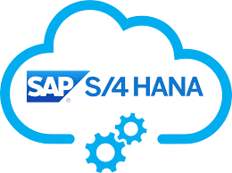

# Sistemas Empresariales Gestion Informacion

**¿QUE SISTEMA DE GESTIÓN DEBEMOS DE ELEGIR?**

         

**PARTE 1**

**Justifica la elección basándote en el perfil de la empresa (25 empleados, presupuesto ajustado, necesidad de personalización en el etiquetado).**
Teniendo en cuenta las necesidades de la empresa dada, hemos decidido que la mejor opción es Zoho One, a pesar de no ser gratuito,
Zoho ofrece una relación calidad-precio inmejorable. 
Con precios muy asequibles y una interfaz 100% en la nube , la plataforma compite directamente con gigantes como Salesforce o Microsoft Dynamics, pero con una lógica más sencilla y económica. como Odoo, su TCO también es muy bajo ya que se usa mucho en empresas pequeñas.
Además, nos ofrece una alta personalización en etiquetas. pudiendo crearlas y editarlas.

**Cálculo de TCO: Realiza una estimación a 3 años. No olvidéis incluir:
Coste de licencias/suscripción.**

El precio de licencia son de unos 37€ por ello, a los 3 años si nuestra empresa son 25 empleados nos costaría: 11.100€ al año

**Coste de implantación (vuestras horas de desarrollo: estima 100h a 40€/h).**

No sabemos exactamente cuanto seria, a priori seria unos 4000€ toda la implantación pero nos ha faltado investigarlo de mejor forma.

**Coste operativo (Hosting en Google Cloud, AWS, Huawei Cloud o similar).**

una interfaz 100% en la nube y no hay que pagar hosting
  
**PARTE 2**

|  | Record rules | Stock/Albaranes | Facturas | Presupuestos |
| :---- | :---- | :---- | :---- | :---- |
| Administrador | ✓  | ✓  | ✓  | ✓  |
| Comercial | ✓  | ✗ | ✗ | ✓  |
| Operario de Almacén | ✗ | ✓  | ✗ | ✗ |
| Contable | ✗ | ✗ | ✓  | ✗ |

**PARTE 3**

1. Fase de planificación
  Hay que repartir los roles de cada empleado, ver qué problemas debe resolver cada uno y si la documentación será digital (por ejemplo pdf) o a mano.
2. Diseño de la información
  Buscar información sobre cuál es el problema, cómo resolverlo y elaborar una tabla de posibles errores.
3. Revisión y Pruebas
  Asegurarse de que todo está en orden, y realizar las pruebas necesarias usando el fragmento de docker-compose.yml necesario y el comando para realizar un backup de la base de datos PostgreSQL.

**PREGUNTAS FINALES**

¿Es coherente el TCO con la realidad de una PYME?

Sí, lo es, para una PYME, el TCO que hemos propuesto cumple con los requisitos de la empresa.

¿La matriz RBAC evita que el comercial vea los costes de producción?

Si, La matriz esta diseñada para que se cumplan los requisitos, entre ellos el comercial no puede ver los costes de produccion.

¿El comando de backup es sintácticamente correcto?

Para desplegar la aplicación, ejecutamos la siguiente instrucción en el directorio donde tengamos el fichero docker-compose.yml:

$ docker-compose up -d Creating network "letschat_default" with the default driver Creating mongo ... done Creating letschat ... done

Podemos ver los contenedores que se están ejecutando:

$ docker-compose ps Name Command State Ports
letschat npm start Up 5222/tcp, 0.0.0.0:80->8080/tcp mongo docker-entrypoint.sh mongod Up 27017/tcp

Podemos acceder desde el navegador a la aplicación:

ip/login

Podemos destruir el escenario:

$ docker-compose down Stopping letschat ... done Stopping mongo ... done Removing letschat ... done Removing mongo ... done Removing network letschat_default

**Bibliografia**

[1]https://www.appvizer.com/magazine/operations/erp/zoho-vs-odoo 

[2]https://www.zoho.com/es-xl/one/plan-details.html 

[3]Documentación de Willman.

[4]https://iesgn.github.io/curso_docker_2021/sesion5/docker-compose.html 
